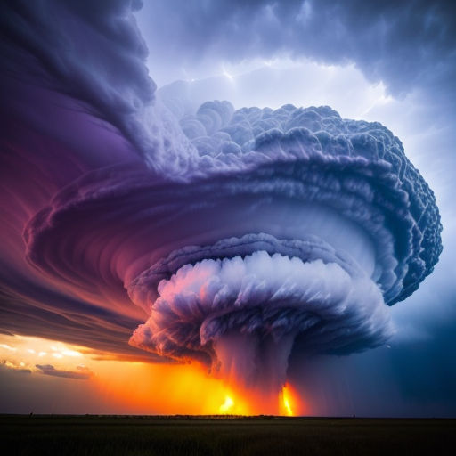

## Ablution by Ablation 

A water, fire, and ice cyclone in the middle of the Indian Ocean. 

Consider a generic cyclone that develops in the middle of the Indian Ocean, and then disrupts [methane hydrate](https://en.wikipedia.org/wiki/Methane_clathrate#Reservoir_size) within the oceans depths, causing megatons of methane being released into the cyclone within minutes, as the frozen molecules suddenly become gaseous due to release in pressure. The gaseous methane then catches fire as the cyclone continues to pick up more of it from the ocean. The eventual phenomena is a hundreds of kilometers wide cyclone wrapped in flames, which moves across British Indian Ocean Territories, subsiding just south of Maldives. 

The silver lining?

The wiped out British Indian Territories could be rebuilt into a global hub for commercial airlines and freight carriers, to improve connectivity between, Dubai and Sydney, for example. 

 

    </img>
     
    <b>Frozen methane is a fragile, subsurface iceberg. Climate change isn't going to handle it with care."</b> 

---

Image source: https://playgroundai.com/post/cljumorkp09ous601vos2wlsl 
